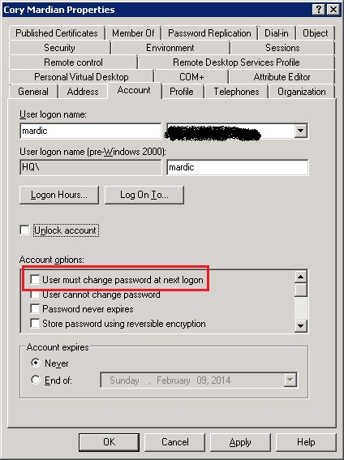

在大多数企业里面，一般都有设置密码策略，包括密码复杂度、密码历史、密码有效期等等。密码到期不修改，系统在你登陆的时候会要求你更改密码，不更改便不让你登陆。但有些人，尤其是上了年纪的用户，往往记不住太复杂或者太多的密码，他们通常会拿纸笔记下来，反而有泄漏的风险。

如果你想不修改密码，延长你的账户有效期的话，这里有个办法：

在 AD 用户的账号属性页面，有个选项叫做 “_用户下次登录时须更改密码_”，把这个选项先勾选上，应用一下，然后再取消勾选，再应用一次，就达到不重置密码也能延长密码有效期的目的了。

*   **User must change password at next logon **
[