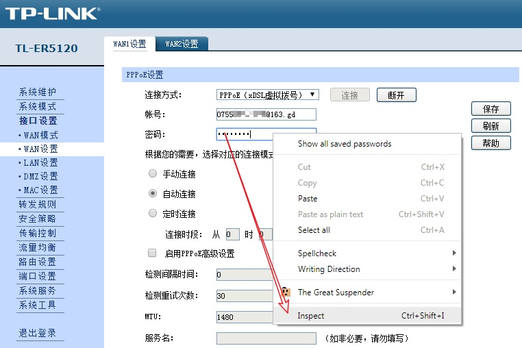
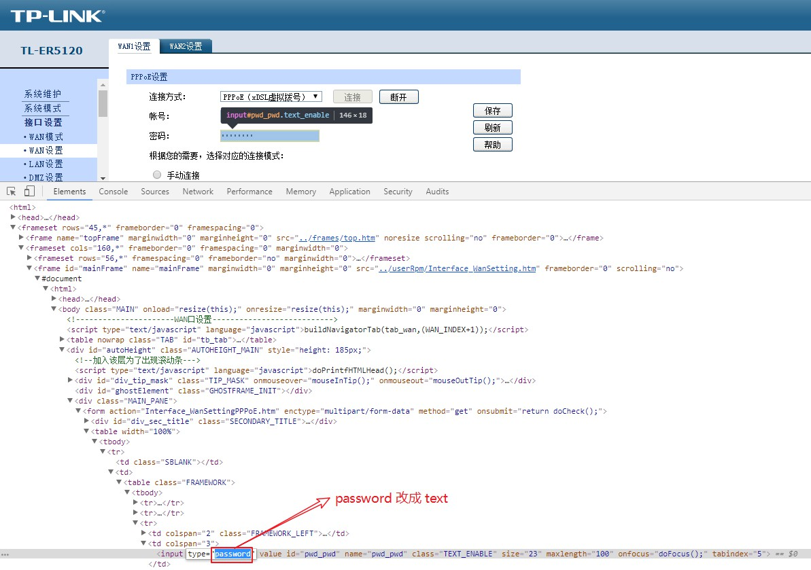
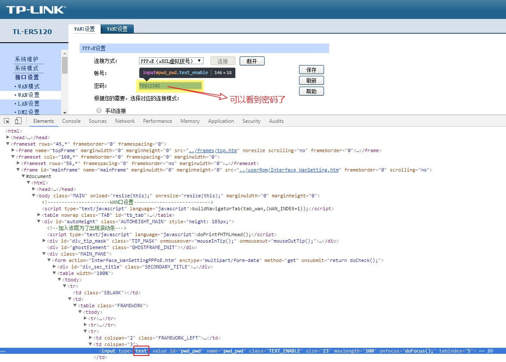

### 起因
最近帮人重新配置路由器，不过他忘记了 PPPOE 的拨号密码是多少，还好原来的路由器 WAN 配置界面上还能看到，不过全是星号，要怎么才能看到里面的密码明文内容呢？这里教大家一个简单易用的方法，不需要安装什么星号密码查看器的软件，也不用啥浏览器的插件，使用浏览器自带的“审查元素”功能即可简单几步查看星号密码内容。

### 步骤：
1. 在 Chrome 浏览器中，鼠标悬停在网页保存的密码字段，点击右键，选择 **Inspect**;

2. 在开发者工具的页面中，找到密码字段对应的 HTML 源码，然后将 <input type="password" 改成 <input type="text" （如下图）

这时在前端网页上面，密码已经明文显示出来了。

> 注：以上示例是使用 Google Chrome 浏览器，Internet Explorer 和 Firefox 也是类似的方法。

