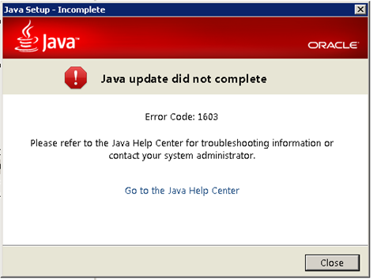

近期访问一些应用的网站老是提示 Java 版本过低，需要升级，于是下载了 jre-8u40-windows 来安装，结果老是装不上去，出现这个 1603 错误，试了很多次都一样。

最后终于解决：
1. 关闭 Java 安装程序;
2. 在 C:\Program Files (x86)\Java\jre1.8.0_40\bin 找到 **javacpl.exe** 文件，运行之；（这里的jre1.8.0_40 指的是 Java 8u40，你的版本如有不同请自行替换）
3. 在 Java 的控制面板的 Security 标签页取消勾选  Enable Java content in browser ， OK 确认；
4. 重新尝试安装 Java8u40;
5. 安装成功后再次运行 **javacpl.exe**，恢复勾选 `Enable Java content in browser`
