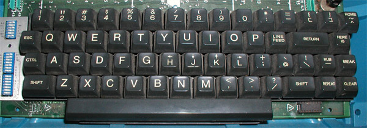

### 问题描述
Ubuntu 中的 Vi 编辑器在编辑模式下，使用上下左右方向键会变成 A B C D 字符并换行，而且退格键也无法删除前面的字符，非常不方便。
这个问题时不时都有人会提，困扰人类十几年了（笑），我好多年前也碰到过，这里再重新记录下。
解决方案有很多种，这里介绍两种常用的：

#### 1. 安装 vim

`$ sudo apt-get install vim`

#### 2. 编辑 Vi 配置文件 /etc/vim/vimrc.tiny

由于这个文件的所有者是 root 用户，所以要在 root 的权限下对这个文件进行修改：

`$ sudo vi /etc/vim/vimrc.tiny`

找到 set compatible，将 "compatible" 改成 "nocompatible" 非兼容模式就可以解决方向键变 ABCD 以及退格键的问题了。
这个修改适用于所有用户，如果只想对当前用户生效，需要在用户 Home 目录下面新建 .vimrc 文件，然后加入 set nocompatible 一行再保存修改即可。

在某些系统下面，可能会出现退格键还是无法使用的现象，那这个时候得在 set nocompatible 后面再加一行：

`set backspace=2` 或者
`set backspace=indent,eol,start`

以上两行二选一，效果一样。

### 结论:
#### 方向键：
产生这个问题的原因是由于 Ubuntu 预安装的是 **vim-tiny** 版本，缺省设置是 vim.tiny 以兼容 Vi 模式运行，意味着更接近纯 Vi，不能使用小键盘和方向键，在编辑模式下，只能使用 h j k l 来移动光标。所以要么安装 vim 完整版，要么禁用兼容模式。在终端窗口输入 vi 回车，如果 vim 跑在兼容模式，你可以看到如下图所示

#### 退格键：
退格键在编辑模式无法使用其实是 Vi 的一个保护性行为，防止误删除或者一次性删除大量内容，并不是 bug，设置 backspace (bs) 可以让退格键重新“工作”起来，默认设置为空 set backspace=""，意即使用 Vi 兼容的退格方式，也就是向左移动一个字符 (等同于 h)

值 | 效果
--- | ---
indent | 允许在自动缩进上退格
eol | 允许在换行符上退格 (连接行)
start | 允许在插入开始的位置上退格；CTRL-W 和 CTRL-U 到达插入开始的位置时停留一次。

所以在配置文件里面加上 **set backspace=2** 或者 **set backspace=indent,eol,start** 就可以啦。

### 引申:
那么为什么 Vi 默认不使用方向键来移动光标？
1. 可以装 X；
2. 兼容性问题；
一般键的 ascii 码直接发就行，而方向键之类的特殊键就要转义成 ESC 序列 ([escape sequence](https://en.wikipedia.org/wiki/Escape_sequence)) 发送，比如上键会被转义成 ESC [ A 编码，某些终端类型不支持，再有就是早期的终端连接速度都很慢，如果在终端接收到 ESC 和 A 之间的时间太长，你可能会听到警告声或者导致指令无法送达，而普通的 hjkl 键就没有这个问题；
3. 键盘没有方向键（图片来自网络）；

4. 习惯问题。

你如果很习惯用 Vi 了，你完全可以弃用方向键的，不过 Vi 的学习曲线还是挺陡的，所以，挑个你习惯的编辑器就好，不必要强求用 Vi。

最后附上一张 Vi/Vim 的键盘快捷方式图镇楼吧。

