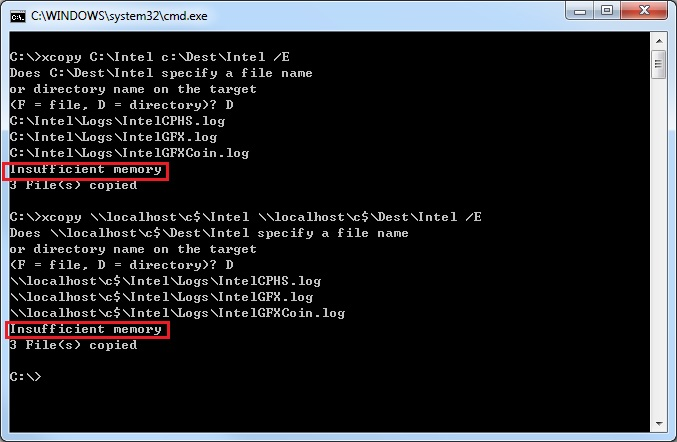

### 前言
众所周知，微软的文件系统经历了 FAT->FAT32->NTFS 的技术变革。且不论安全和文件组织方式上的革新，单就文件名而言，已经从古老的 DOS 8.3 文件格式（仅支持最长 8 个字符的文件名和 3 个字符的扩展名）转变为可以支持长达 255 个字符的文件名。而对于路径长度，NTFS 也已经支持长达 32768 个字符的路径名。

然而，Windows 操作系统并没有完全放开路径名长度的限制，在 windef.h 中，可以找到如下的宏：

#define MAX_PATH 260

更多信息可以参考微软的知识库：
[Naming Files, Paths, and Namespaces](https://msdn.microsoft.com/en-us/library/windows/desktop/aa365247%28v=vs.85%29.aspx)

事实上，所有的 Windows API (ANSI) 都遵循这个限制。因此，每当我们试图更改某一文件的文件名时，当输入的文件名长度 ( 全路径 ) 到达一定限度时，
虽然文件名本身还未达到 255 个字符的限制，但是任何输入将不再被接受，这其实正是由于操作系统不允许 260 个字符（byte）的文件全路径。

### 实测
实际测试中，当你一层一层创建文件夹或者创建文件名的时候，资源管理器是有感知的，当到达 MAX_PATH 的限制的时候，其实已经无法再创建超过限制的文件或者文件名，当你在最深一层打算创建一个文件或者文件夹并因此超过限制的时候，你会收到如下警告：

重命名也是有报错

但如果你往上返回一层，重命名上层目录，这个时候你可以创建出一个总长度超过 MAX_PATH 的长文件名。不过问题也随之来了，当你想要复制包含这个长文件名的整个文件夹的时候，你会发现复制失败，提示文件或者路径太长。

那么使用 xcopy 命令行不行呢？很遗憾，xcopy 是个使用标准 Win32 ANSI API 的程序，没法支持。

### 解决
解决方案有很多种，比如将长文件夹/文件名字改短，将长路径映射为一个逻辑磁盘用来缩短路径的长度等等，我们这里使用 robocopy 这个自带的命令和第三
方工具 fastcopy 来解决这个问题。

#### Robocopy
Robocopy 全名是 Robust File Copy，是个 Unicode 的程序，所以可以支持超过 MAX_PATH 的限制，最长可以到 32767，Windows 7 以及之后的操作系统内的是 XP027, 而 Windows Server 2003 Resource Kit Tools 里面的是 XP010，另外，微软为命令行苦手发布了一个 [Robocopy GUI](https://technet.microsoft.com/en-us/library/2006.11.utilityspotlight.aspx) 的图形界面版 robocopy，里面集成的是 XP026，具体的区别可以查看这个[网页](https://ss64.com/nt/robocopy.html)。

> 注意：微软还发布了一个 [RichCopy](
https://technet.microsoft.com/en-us/library/2009.04.utilityspotlight.aspx
)，实测这个并不能支持长路径名。

#### FastCopy
[FastCopy](https://ipmsg.org/tools/fastcopy.html)是由  SHIROUZU Hiroaki 开发的免费工具，非常好用。官方的介绍里面也提到了支持 Unicode 和突破 MAX_PATH 260 字符的限制。

实测结果也验证了这一点。

#### Win10
从 Windows 10 1607起，你可以解除 MAX_PATH 的限制，具体可以参考这个[文章](https://blogs.msdn.microsoft.com/jeremykuhne/2016/07/30/net-4-6-2-and-long-paths-on-windows-10/)。
