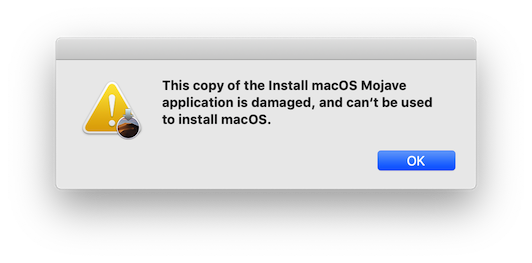
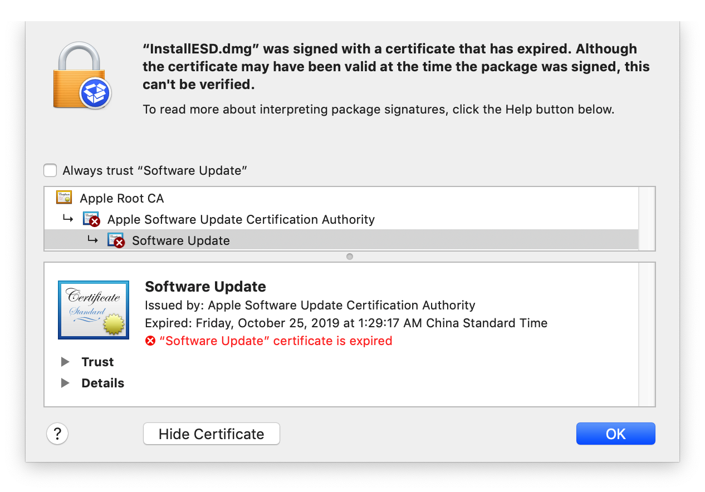
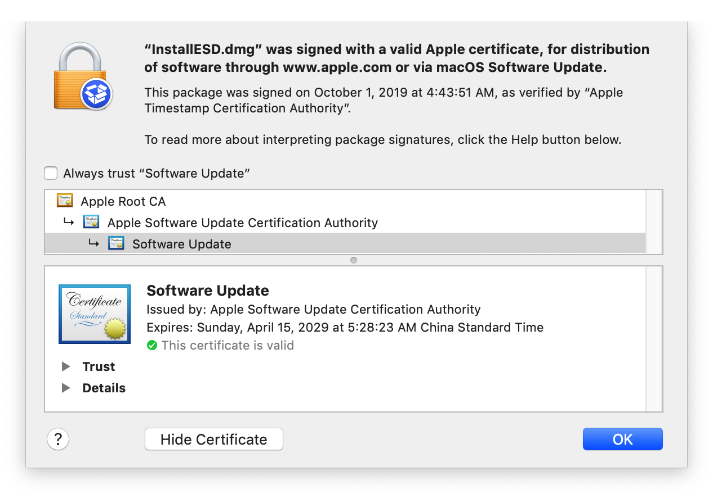

### 起因
如果你还保留旧的 macOS 安装镜像， 那么很遗憾的告诉你这些镜像会在 2019-10-25 之后停止工作。这主要是由于大多数安装镜像中的证书会过期，从而导致这些镜像无法使用。
错误提示如下：

通过检查 Mojave 的安装镜像，你会发现里面包含的证书已经过期;

### Fix：
两个解决方法，任选其一：

第一种，重新从苹果官方下载更新过的 Mojave 安装镜像，里面的证书已经更新：

第二种，修改当前系统的时间去到 **2019-10-24** 日之前，使安装镜像的证书还在有效期内：
- 断开网络。
- 打开 **Terminal** 终端工具，输入 `sudo date -u 0924150019`，修改时间为 2019年9月24日15时，再进行安装即可。

