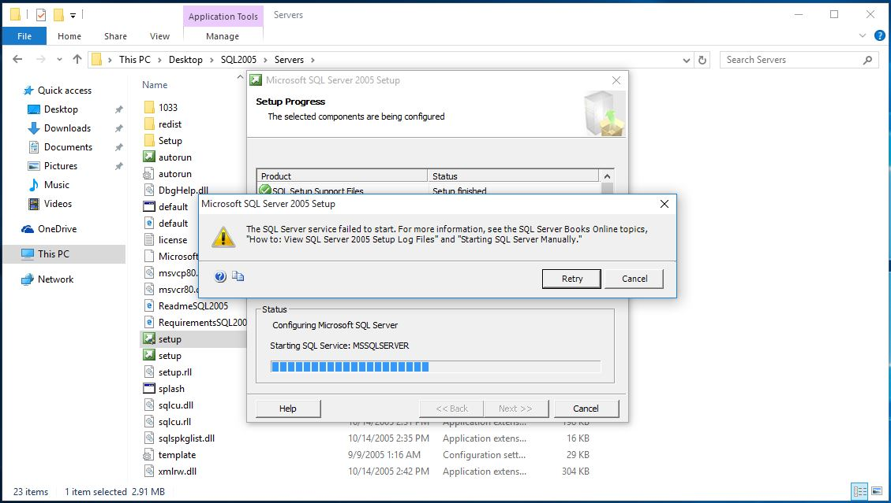
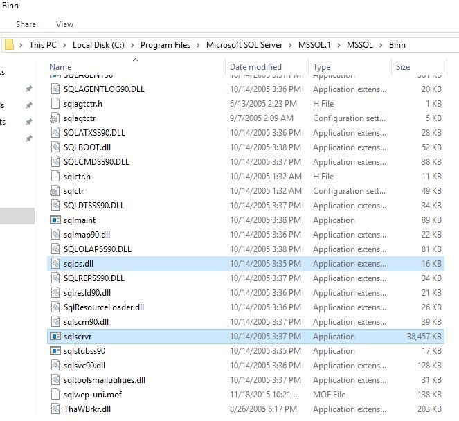
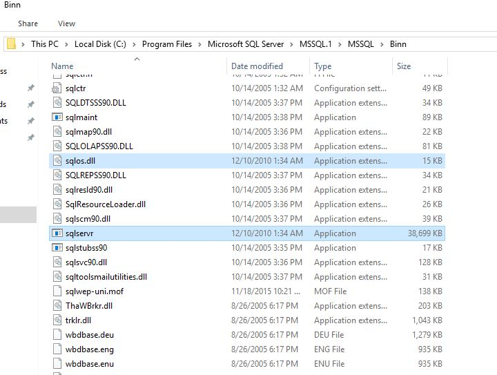
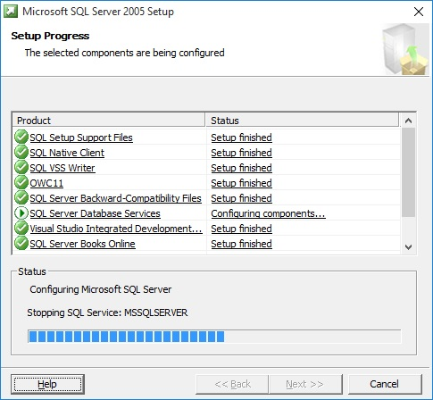
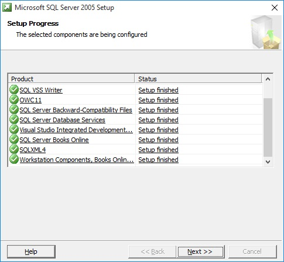

正常情况下，在 Windows 10 是没有办法安装 SQL2005 的，参见微软的这个文章：
[Using SQL Server in Windows 8 and later versions of Windows operating system](https://support.microsoft.com/en-us/help/2681562/using-sql-server-in-windows-8-and-later-versions-of-windows-operating)

> Microsoft SQL Server 2005 (the release version and service packs) and earlier versions of SQL Server are not supported on Windows 10, Windows Server 2016, Windows Server 2012 R2, Windows Server 2012, Windows 8.1, or Windows 8. You will receive a warning in the Action Center if Windows 10, Windows 8.1, or Windows 8 detects an instance of SQL Server 2005.

其实，办法还是有的，不过因为并不是官方推荐做法或者解决方案，所以微软不会在这种场景下为你提供技术支持。

1. 找一台已经安装好 SQL Server 2005 并且打上 SP4 补丁的机器 （Windows Server 2003/Windows7 等都行），从上面拷贝 **sqlservr.exe** 和 **sqlos.dll** 两个文件 （默认应该在 C:\Program Files\Microsoft SQL Server\MSSQL.1\MSSQL\Binn）到临时目录，需要注意的是这个机器上面的 SQL 版本应该和你在 Win10 上面要装的版本一致 (x86/x64，中文/英文等等)；
2. 在 Win10 上面安装 SQL Server 2005 RTM；
3. 安装到一半会报个错，SQL Server 服务无法启动，见下图；

此时先不要关掉这个界面，从临时目录复制 **sqlservr.exe** 和 **sqlos.dll** 到 Win10 的 SQL 安装路径 （同样是 C:\Program Files\Microsoft SQL Server\MSSQL.1\MSSQL\Binn）下面替换原来的 RTM 的文件；

替换前的文件信息

替换后的文件信息

**注意 SP4 文件的修改时间应该是 2010年12月10日**
4. 回到 SQL Server 的安装界面，点击 "**Retry**" 重试，安装得以继续进行；

5. 安装完成之后，马上打上 SP4 的补丁，确保所有应该被更新的文件都更新到了 SP4。

另：SQL Server 2005 的 Management Studio 在 Win10 下面会有些小问题，比如连接的时候看不到实例，如果需要可以安装 SQL Server 2008 R2 之后的版本。

以上测试环境为
Windows 10 LTSB 10240 Pro 64-bit
SQL Server 2005 std 64-bit RTM + SP4

