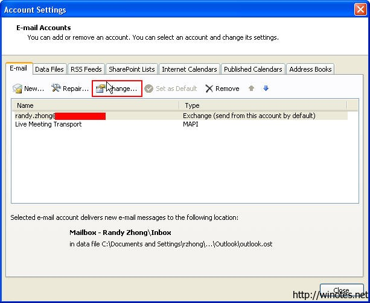
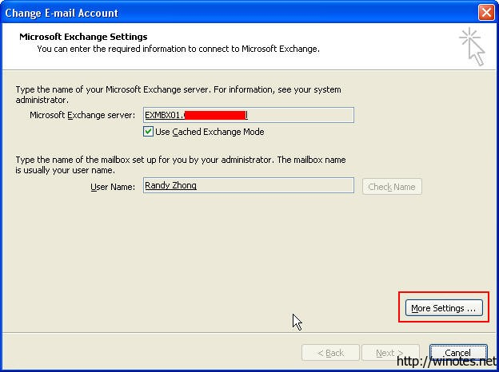
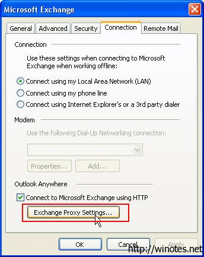
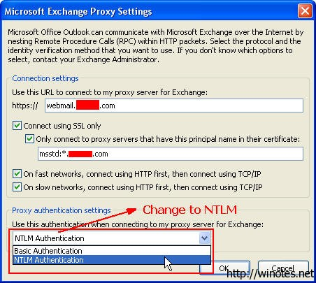
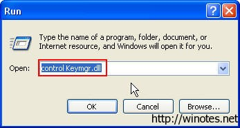
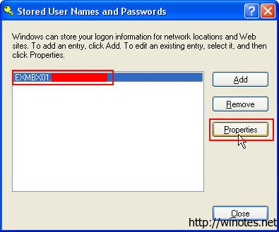
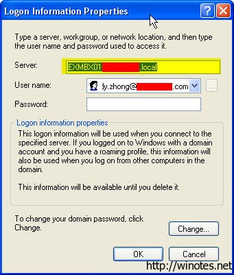
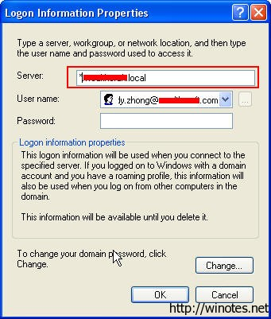

How to make your computer remember your Microsoft Communicator 2007 R2 and Outlook 2007 password (如何让你的电脑在非域环境中记住 OC 2007 R2 和 Outlook 的密码)

我们知道，在域的环境中，使用 OC 和 Outlook 都可以使用 Windows 的集成验证来完成用户验证过程，也能很方便的记住密码自动登录，但是如果你的电脑没有在域环境中或者工作站所在的域与 Exchange/OCS 所在的域没有联系呢？ 这个时候，你甚至连"保存密码"的复选框都看不到，怎么办？

#### A. Outlook 2007 (同样适用于 Outlook 2003/2010)
1. 退出 Outlook（如果在运行的话）。
2. 控制面板 -&gt; 邮件 -&gt; 邮件账户..., 点击 "更改..."。

3. 在 "更改电子邮件账户" 对话框, 点击 "更多设置"。
4. 转到 "连接" 标签卡, 点击 "Exchange 代理设置"。

5. 在代理认证这里，将认证方式从基本认证改为 NTLM 认证。

6. 点击 "OK" 两次确认。
7. 接着点击下一步和完成按钮。
8. 重新打开 Outlook , 你就能看到那 "记住密码" 选项又出来了，输入你的邮件地址和密码, 选中记住密码功能。
9. 这一步是关键！点击开始-&gt; 运行, 输入 `control Keymgr.dll`

10. 确认你选择的是 Exchange 邮箱角色服务器地址，比如 EXMBX01.company.local ， 然后点击 "属性"。

11. 将服务器属性从 "EXMBX01.company.local" 改成 "\*.company.local", 点击 **OK** 确定。

#### B. Communicator
1. 打开注册表，找到 `HKEY_CURRENT_USER\Software\Microsoft\Communicator`，新建一个 DWORD 记录，名字为 SavePassword ， 修改其值为 1 。当然，你也可以去到微软站点下载OCS的组策略模板，导入AD中，实现批量修改。 
2. 关闭并完全退出 communicator ， 然后重新打开, 你会看到 "保存我的密码", 选中后点击登入。

注意: 如果你以后修改了你的 Exchange 或者 OC 的密码，要记得再重复第10步。