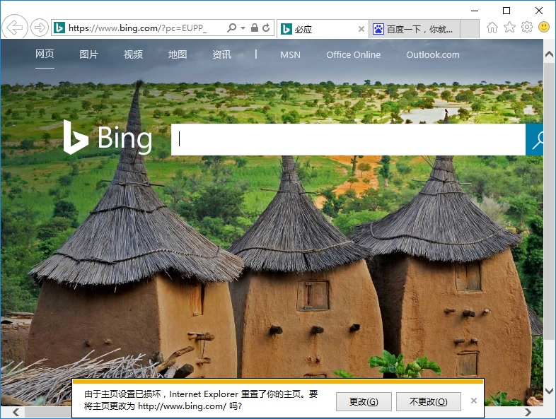
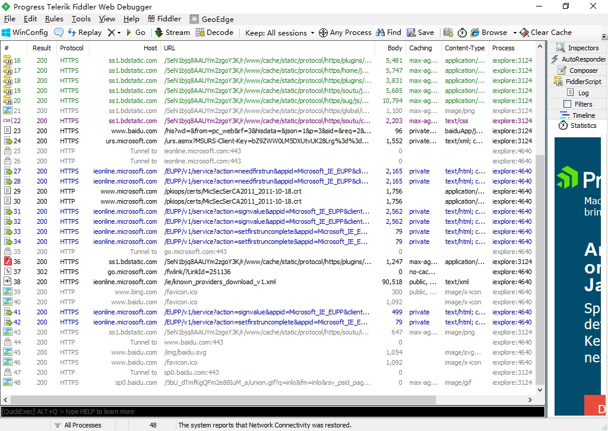
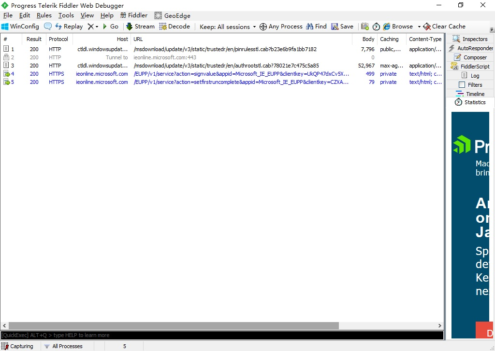
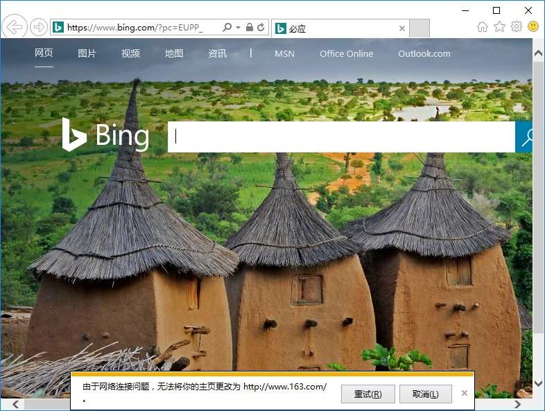

> 北京时间2015年9月24日，美国华盛顿州雷德蒙德，百度与微软正式宣布战略合作，百度将成为中国市场上Windows 10 Microsoft Edge浏览器的默认主页和搜索引擎，带给用户更加便捷的搜索服务。同时，百度也将通过“Windows 10直通车”提供Windows 10下载升级服务。

#### 前言
以上是来自微软官方消息，不过最近有部分使用 IE11 的用户发现，启动浏览器会发现默认主页被重定向到了百度带尾巴的首页 [https://www.baidu.com/?tn=80035161_1_dg，](https://www.baidu.com/?tn=80035161_1_dg) 而默认的搜索引擎也被改成了百度，而且更过分的是，你还无法修改默认主页，一旦修改就会出现“由于主页设置已损坏， Internet Explorer 重置了你的主页。你是否要将主页改为……”，每次打开 IE 都会出现这样的提示，甚至重装系统依然如此。



这既不是 DNS 劫持，也不是啥恶意软件，这个微软官方推行的浏览器保护机制，只不过落地在国内，默认主页和搜索引擎提供者变成了百度，谁让 Bing 不争气啊。

<!--more-->

#### 分析
这些受影响的 IE11 在启动的时候，会通过 ieonline.microsoft.com 上的 webservice 更新部分设置，如下图：


在更改默认主页的时候，也同样有去访问 ieonline.microsoft.com 


#### 解决方案
通过 Fiddler 抓包和 ProcMon 分析，找到以下解决方法：
1. 首先编辑本机hosts文件，在其中添加**127.0.0.1 ieonline.microsoft.com**
2. 打开注册表编辑器，找到 **[HKEY_CURRENT_USER\\SOFTWARE\Microsoft\\Internet Explorer]**，删除**EUPP**项
3. 打开注册表编辑器，找到 **[HKEY_LOCAL_MACHINE\\SOFTWARE\\Microsoft\\Internet Explorer\Main\\FeatureControl]**，在下面新建项**FEATURE_EUPP_GLOBAL_FORCE_DISABLE**，然后在这个项下面新建一个 **DWORD32** 值，键值名称为 **iexplorer.exe** ，键值改成1
注册表文件如下：
``` plain
Windows Registry Editor Version 5.00

[HKEY_LOCAL_MACHINE\SOFTWARE\Microsoft\Internet Explorer\Main\FeatureControl\FEATURE_EUPP_GLOBAL_FORCE_DISABLE]
"iexplorer.exe"=dword:00000001
```
4. 之后再去修改 IE 默认主页就可以了
5. 这样修改之后，实际上在注册表中 HKEY_CURRENT_USER\SOFTWARE\Microsoft\Internet Explorer 下面还是会创建 EUPP 项，不过会少了一些东西，只剩下一个 叫 RId 的字符串值，暂时不知道有没有别的啥影响，强迫症患者可以用这个注册表文件还原成原始值
``` plain
Windows Registry Editor Version 5.00

[HKEY_CURRENT_USER\SOFTWARE\Microsoft\Internet Explorer\EUPP]
"RId"="{0E742E0E-7B2B-4372-84A0-507D6539A665}"
"ChangeNotice"=dword:00000002

[HKEY_CURRENT_USER\SOFTWARE\Microsoft\Internet Explorer\EUPP\DSP]
"ChangeNotice"=dword:00000002
```
#### 结论:
产生这个问题的原因是 IE 启动的时候，会通过 ieonline.microsoft.com 上的 webservice 更新 EUPP 键值内容，其中最关键的是 BackupHomePage 和子项 DSP 下面的 BackupDefaultSearchScope 的这两个二进制值锁定主页和搜索提供程序的 URL，新安装的系统里面，BackupHomePage和 BackupDefaultSearchScope 键值还没有被创建。之后一旦可以联网，IE 会更新注册表，从而锁定主页和搜索提供程序，而且这些二进制值是加密的，有兴趣的可以参考这篇文章：http://bbs.pediy.com/thread-196517.htm

所以和 Windows 10 的版本或者 IE 补丁程序无关，此方法在 Win10 LTSB 中文 64 位 1607 版本上测试通过。

#### 2017年9月14日更新：
**貌似这两天微软已经把 EUPP 的 webservice 做了更新，不再强制修改成百度了，所以即使你不应用上面的注册表和 hosts 文件修改，也可以像以前一样任意修改默认主页了。**
另1：如果是单单通过 hosts 文件屏蔽 ieonline.microsoft.com 的，要取消这个屏蔽，否则你的IE默认主页会锁定在屏蔽ieonline.microsoft.com之前的设定，无法修改成新的。

另2：从 ieonline.microsoft.com 拿到的 ChangeNotice 的值在9月14日之后也有了变化，以前会被重置成2，现在是0,从名字猜测来看应该是提示主页设置被更改的旗标 (flag) 设置。

最后放上各个阶段的注册表 EUPP 项导出文件供参考 
