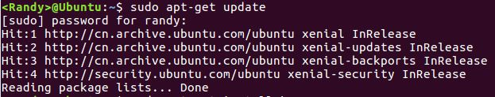
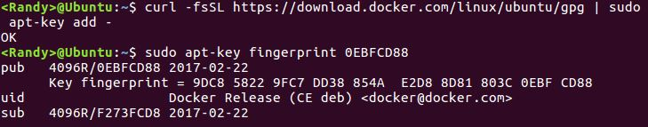
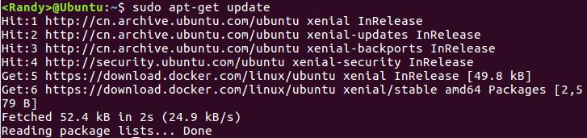
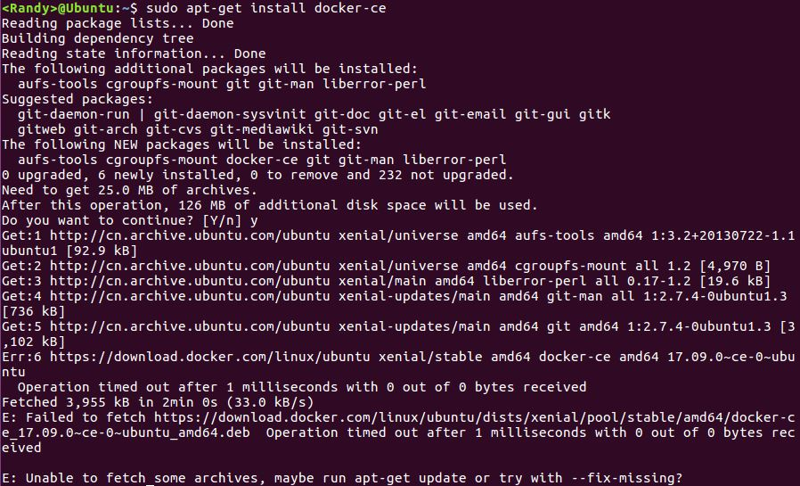
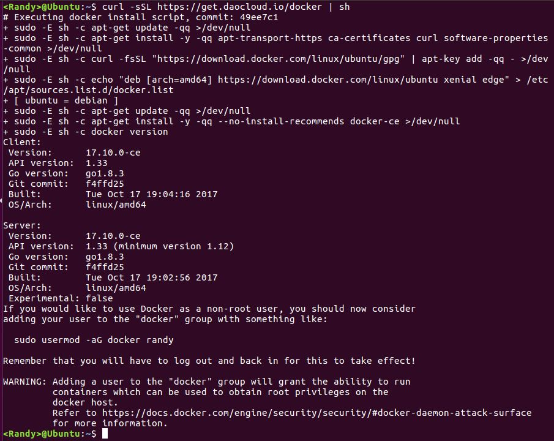
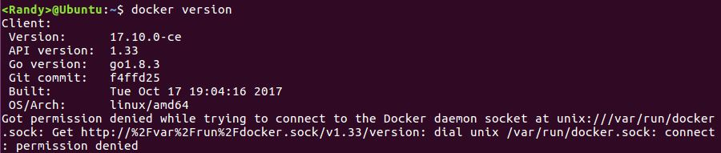
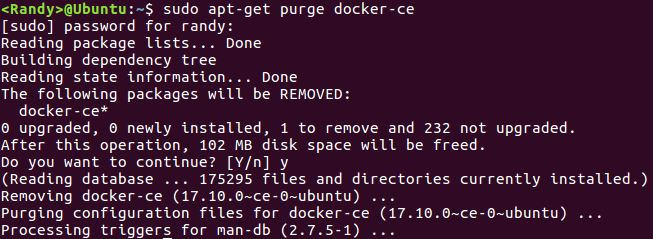

安装 Docker 有很多种方式，常用的有三种：
1. 大部分人使用官方提供的 Docker 仓库，安装简单，也易于升级，推荐使用这种方法
2. 你也可以下载 DEB 包来手动安装和手动升级。通常这种方法适用于在没有互联网连接的与外界物理隔离的机器上安装 Docker
3. 在开发和测试环境，也可以选择使用脚本来自动安装 Docker

Docker 一开始是没有区分 EE 和 CE 版本的，随着 Docker 的流行，自17.03版本以后分为 CE (Community Edition - 社区版) 和 EE(Enterprise Edition - 企业版)，社区版并非阉割版，可以免费使用，企业版则提供了一些收费的高级特性，我们这里选择从官方仓库来安装 CE 社区版。

<!--more-->

#### 更新 APT
1. 更新 apt 软件包列表

`$ sudo apt-get update`



2. 安装如下包使 apt 可以通过 HTTPS 来从仓库安装软件
``` bash
sudo apt-get install \
    apt-transport-https \
    ca-certificates \
    curl \
    software-properties-common
```
3. 添加 Docker 官方的 GPG Key

`$ curl -fsSL https://download.docker.com/linux/ubuntu/gpg | sudo apt-key add -`

4. 校验 GPG Key 的指纹，最后8位应该是 0EBFCD88

`$ sudo apt-key fingerprint 0EBFCD88`



5. 安装 stable 的 Docker 仓库，一般使用 stable 这个稳定版本。
``` bash
sudo add-apt-repository \
   "deb [arch=amd64] https://download.docker.com/linux/ubuntu \
   $(lsb_release -cs) \
   stable"
```

#### 安装 Docker CE
##### 更新 apt 软件包列表

`$ sudo apt-get update`

这个时候你可以看到 docker 的源了

##### 安装最新的社区版

`$ sudo apt-get install docker-ce`

然而，如果你在国内，你可能会遇到如下错误：


这是因为 Docker 的安装资源文件存放在 Amazon S3，有可能会被伟大的功夫网拦在外面，另外一个可能的原因是 S3 在国内连接太慢，会间歇性连接失败。
还好国内的 [DaoCloud](https://get.daocloud.io/#install-docker) 公司提供了下面的快速安装方法（实际上就是用第三种的脚本安装）：

`$ curl -sSL https://get.daocloud.io/docker | sh`

这个方法适用于 Ubuntu，Debian,Centos 等大部分 Linux，DaoCloud 会每3小时同步一次 Docker 官方源。



#### 检查 Docker 版本

`$ docker version`


这里需要多一条命令来添加当前用户到 docker 组，这样不用 root 权限也可以使用 Docker
`$ sudo usermod -aG docker username`  #这里的 username 就是你的非 root 用户名

> 运行之后需要注销重新登录才能生效

``` bash
$ docker version

Client:
 Version:      17.10.0-ce
 API version:  1.33
 Go version:   go1.8.3
 Git commit:   f4ffd25
 Built:        Tue Oct 17 19:04:16 2017
 OS/Arch:      linux/amd64

Server:
 Version:      17.10.0-ce
 API version:  1.33 (minimum version 1.12)
 Go version:   go1.8.3
 Git commit:   f4ffd25
 Built:        Tue Oct 17 19:02:56 2017
 OS/Arch:      linux/amd64
 Experimental: false
```

#### 卸载 Docker CE
`$ sudo apt-get purge docker-ce`


卸载 Docker 后, /var/lib/docker/目录下会保留原 Docker 的镜像，存储卷，自定义配置等文件。 如果需要全新安装 Docker，需要删除/var/lib/docker/目录。

`$ sudo rm -rf /var/lib/docker`
