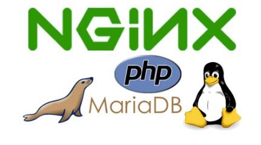
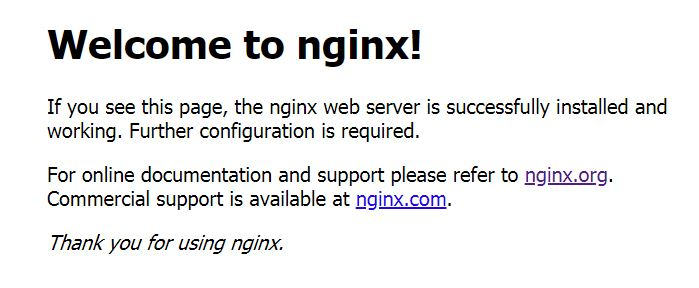

## 什么是 LEMP

以前我们常常听说的 LAMP (Linux, Apache, MySQL, and PHP) 是最经典的建站环境之一，迄今仍旧够到很多中小站长的欢迎。但 Apache 的缺点是有些臃肿，资源开销比较大，对硬件的要求相较于其它一些轻量的 Web 服务器要高，， 而 MySQL 的母公司 SUN 在被 Oracle 收购之后，社区担心 MySQL 的开源许可可能会存在闭源风险，于是 MySQL 之父 Michael Widenius (often called Monty) 以他女儿 Maria 的名字创建了MySQL的另外一个衍生版本：MariaDB。在用 NGINX 替代 Apache 和 MariaDB 替代 MySQL 之后，LEMP 就诞生了，尤其适用于服务器资源吃紧，内存少又想压榨出高并发高流量性能的场景。
<!--more-->

## 测试环境
本文所述的环境基于腾讯云 CentOS 7.5 64-bit 公共镜像搭建，安装完成后的各组件版本如下：
- CentOS 7.5 64-bit
- NGINX 1.14.2
- MariaDB 5.5.60
- PHP 5.6.39*
> *CentOS 官方默认带的 PHP 为 5.4.16，而我们某些程序需要 5.6+ 才能正常运行，本文的目的就是记录下如何安装 PHP5.6 的 LEMP环境

## 开始前的准备工作
### 时间设置
**列出当前时间相关设置**
`timedatectl status`
```text
      Local time: Fri 2018-12-28 13:20:01 CST
  Universal time: Fri 2018-12-28 05:20:01 UTC
        RTC time: Fri 2018-12-28 05:19:59
       Time zone: Asia/Shanghai (CST, +0800)
     NTP enabled: no
NTP synchronized: yes
 RTC in local TZ: no
      DST active: n/a
```
**1.设置时区**
`sudo timedatectl set-timezone Asia/Shanghai` （这一步腾讯云的 CentOS 公共镜像已经设置好，可跳过）
**2.安装 NTP**
`sudo yum install ntp`
**3.设置为与 NTP 服务器同步**
`sudo timedatectl set-ntp true`
**4.同步时间**
`sudo ntpdate pool.ntp.org`
**5.再检查时间设置**
`timedatectl status` 
```text
 Local time: Fri 2018-12-28 14:05:53 CST
  Universal time: Fri 2018-12-28 06:05:53 UTC
        RTC time: Fri 2018-12-28 06:05:51
       Time zone: Asia/Shanghai (CST, +0800)
     NTP enabled: yes
NTP synchronized: yes
 RTC in local TZ: no
      DST active: n/a
```

### 安装 yum-utils 软件包便于管理维护
`sudo yum install yum-utils`

### 获取系统最新更新
`sudo yum update` #生产环境慎用，这条命令会更新所有软件包，可能会破环依赖关系
或者用下面 `sudo yum -y update --security` 这条命令只更新安全补丁，胆子小的可以用 `sudo yum update-minimal --security -y`
> 不管更新啥，在测试环境测好再部署到生产环境是必要的

### 添加含有各种 PHP 版本的 Remi 仓库 (本文用的清华大学镜像站点)
`sudo yum install https://mirrors.tuna.tsinghua.edu.cn/remi/enterprise/remi-release-7.rpm`

### 启用 Remi 仓库中 PHP 5.6 的源
`sudo yum-config-manager --enable remi-php56`

## NGINX
本文推荐从 NGINX 的官方源来安装
**1.创建 `/etc/yum.repos.d/nginx.repo` 文件，内容如下**
```config
[nginx]
name=nginx repo
# Choose mainline or stable release
baseurl=http://nginx.org/packages/centos/$releasever/$basearch/
# baseurl=http://nginx.org/packages/mainline/centos/$releasever/$basearch/
gpgcheck=0
enabled=1
```
**2.更新源信息**
`sudo yum check-update`

**3.安装 NGINX**
`sudo yum install nginx`

**4.启动 NGINX**
`sudo systemctl start nginx`

**5.将 NGINX 添加到开机自启动**
`sudo systemctl enable nginx`

**6.测试 NGINX**


## MariaDB
**1.安装 MariaDB 和 MySQL/MariaDB-PHP 支持包**
`sudo yum install mariadb-server php-mysql`

**2.启动 MariaDB**
`sudo systemctl start mariadb`

**3.将 MariaDB 添加到开机自启动**
`sudo systemctl enable mariadb`

**4.安全设置**
`sudo mysql_secure_installation`

因为是新安装的 MariaDB，还没有为 root 用户设置密码，直接按回车键
Enter current password for root (enter for none):

接下来按 **Y** 设置 root 密码 
Set root password? [Y/n] Y
New password:
Re-enter new password:
Password updated successfully!
Reloading privilege tables..
 ... Success!

按 **Y** 或者直接回车键接受以下四个默认安全设置
- Remove anonymous users?
- Disallow root login remotely?
- Remove test database and access to it?
- Reload privilege tables now?

最后看到如下字样即表示安全设置完成
```text
All done!  If you've completed all of the above steps, your MariaDB
installation should now be secure.

Thanks for using MariaDB!
```
## PHP 5.6
**1.安装 PHP FastCGI Processing Manager**
`sudo yum install php-fpm`

**2.已知漏洞修复**
编辑 **/etc/php.ini** 文件，关闭 NGINX + PHP-FPM 中关于 fix_pathinfo 的一个漏洞，详情参见[这篇文章](http://www.laruence.com/2010/05/20/1495.html)
`sudo sed -i 's/;cgi.fix_pathinfo=1/cgi.fix_pathinfo=0/g' /etc/php.ini`

**3.修改 **/etc/php-fpm.d/www.conf**
PHP 默认是以 Apache 来作为 Web 服务器的，所以其运行的默认用户为 `apache`，我们需要修改为 `nginx`
```bash
sudo sed -i 's/user = apache/user = nginx/g' /etc/php-fpm.d/www.conf
sudo sed -i 's/group = apache/group = nginx/g' /etc/php-fpm.d/www.conf
```
**4.启动 PHP-FPM**
`sudo systemctl start php-fpm`

**5.将 MariaDB 添加到开机自启动**
`sudo systemctl enable php-fpm`

## 配置 NGINX 使其解析 PHP 文件
**1.创建你网站程序的目录**
`sudo mkdir -p /var/www/example.com/`

**2.禁用 NGINX 默认的站点配置文件**
`sudo mv /etc/nginx/conf.d/default.conf /etc/nginx/conf.d/default.conf.disabled`

**3.创建 example.com 的站点配置文件**
`sudo vi /etc/nginx/conf.d/example.com.conf`
```nginx
server {
    # Ipv4
    listen 80;

    # IPv6
    # listen [::]:80;

    # SSL Ipv4 & v6
    # listen 443 ssl;
    # listen [::]:443 ssl;

    # [REQUIRED EDIT] Your domain name goes here
    server_name example.com www.example.com;

    # [REQUIRED EDIT] Absolute path to your website root on the filesystem
    root /var/www/example.com;
        
    index index.php index.html index.htm;

    # PHP FPM part
        location ~ [^/]\.php(/|$) {
                fastcgi_split_path_info ^(.+?\.php)(/.*)$;
                if (!-f $document_root$fastcgi_script_name) {
                        return 404;
                }

        # Mitigate https://httpoxy.org/ vulnerabilities
        fastcgi_param HTTP_PROXY "";

         fastcgi_pass 127.0.0.1:9000;
         fastcgi_index index.php;

        # include the fastcgi_param setting
        include fastcgi_params;

        # SCRIPT_FILENAME parameter is used for PHP FPM determining
        #  the script name. If it is not set in fastcgi_params file,
        # i.e. /etc/nginx/fastcgi_params or in the parent contexts,
        # please comment off following line:
        fastcgi_param  SCRIPT_FILENAME   $document_root$fastcgi_script_name;    
        }
}
```
**4.测试 PHP 解析**
`sudo vi /var/www/example.com/info.php`

编辑该文件内容如下：
```php
<?php phpinfo(); ?>
```
然后访问 http://example.com/info.php ，正常的话你应该能看到 PHP 信息页面了。

**5.404 not found/403 Forbidden**
如果你确认以上操作都已经正常进行，NGINX 和 PHP-FPM 的配置文件都已经改好，但是在访问 PHP 页面的时候出现 404 not found/403 Forbidden 或者 FastCGI sent in stderr: Unable to open primary script 错误，那么有可能是 SELinux 的问题。你可以通过查看 SELinux 的审计日志 **/var/log/audit/audit.log** 来确认，一般会出现 avc: denied { read } for pid=1213 comm="nginx" name=“info.php”... 之类的错误。
问题确认后，我们用 `setstatus` 来查看当前的 SELinux 设置
```bash
# sestatus
SELinux status:                 enabled
SELinuxfs mount:                /sys/fs/selinux
SELinux root directory:         /etc/selinux
Loaded policy name:             targeted
Current mode:                   enforcing
Mode from config file:          enforcing
Policy MLS status:              enabled
Policy deny_unknown status:     allowed
Max kernel policy version:      31
```
 或者 `cat /etc/selinux/config` 
```bash
# cat /etc/selinux/config 

# This file controls the state of SELinux on the system.
# SELINUX= can take one of these three values:
#     enforcing - SELinux security policy is enforced.
#     permissive - SELinux prints warnings instead of enforcing.
#     disabled - No SELinux policy is loaded.
SELINUX=enforcing
# SELINUXTYPE= can take one of three two values:
#     targeted - Targeted processes are protected,
#     minimum - Modification of targeted policy. Only selected processes are protected. 
#     mls - Multi Level Security protection.
SELINUXTYPE=targeted
```

如果当前状态是 **enforcing**，说明 SELinux 已经启用，那么你可以试着用 `setenforce 0` 禁用 SELinux（只显示告警）再尝试访问 PHP 文件，如果可以成功访问那你也有两个选择，一是禁用 SELinux （可能没那么安全），二是使用 **restorecon** 来恢复网站目录的 SELinux 安全配置上下文信息：
`restorecon -R -v /var/www/example.com`

若是之后部署有些网站程序还是没法访问，确定是 SELinux 的锅但是你又想留着它的话，可参考以下几篇文章：
- [Using NGINX and NGINX Plus with SELinux](https://www.nginx.com/blog/using-nginx-plus-with-selinux/)
- [SELinux - CentOS Wiki](https://wiki.centos.org/HowTos/SELinux)
- [Configuring SELinux Policies for Apache Web Servers](https://www.serverlab.ca/tutorials/linux/web-servers-linux/configuring-selinux-policies-for-apache-web-servers/) - 这篇讲 Apache 的，但还是可以作为参考
