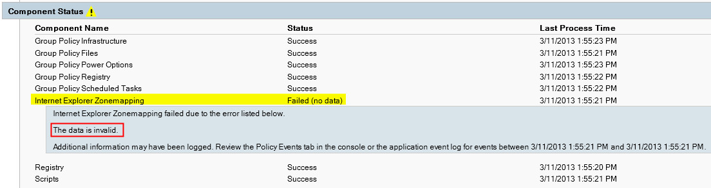
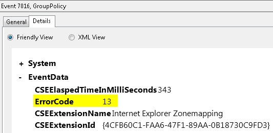
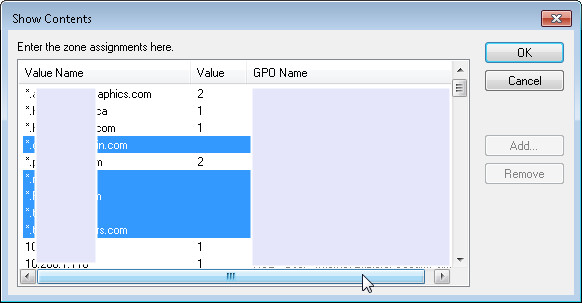

今天新建了个组策略，跑个 gpupdate /force 强制更新下，发现有警告信息：
```msdos
C:\Users\user>gpupdate /force Updating Policy...

User Policy update has completed successfully.

The following warnings were encountered during user policy processing:

Windows failed to apply the Internet Explorer Zonemapping settings. Internet Explorer Zonemapping settings might have its own log file. Please click on the "More information" link. Computer Policy update has completed successfully.

For more detailed information, review the event log or run GPRESULT /H GPReport. html from the command line to access information about Group Policy results.
```
运行 `gpresult /h gpreport.html`，打开这个html文件一看

Internet Explorer Zonemapping failed due to the error listed below.
The data is invalid.

再来看看事件查看器中有没有相关日志，还真找到一条 Event ID:7016 的错误日志

Completed Internet Explorer Zonemapping Extension Processing in 343 milliseconds.



我们看到这里的 <span style="color: #ff0000">ErrorCode</span> 是 **13**.

现在，收集到的信息还是不足以给我们提供判断依据，我们来启用 GPSvc 的调试日志来看看更详细的日志

Windows 7/Vista/2008 请参照以下步骤，Widnows XP/2003 请参照微软 [KB221833](http://support.microsoft.com/kb/221833 "How to enable user environment debug logging in retail builds of Windows")

1.  在 %windir%\debug\下面创建 usermode 目录
2.  打开注册表编辑器，找到
**HKEY_LOCAL_MACHINE\Software\Microsoft\Windows NT\CurrentVersion**
3.  新建Key键值  Diagnostics
4.  在该键值下面创建名为GPSvcDebugLevel的 DWORD 键值，并将其修改为16进制的 30002 (hex)
5.  退出注册表编辑器
6.  在命令行下再运行 gpupdate /force
7.  在 %windir%\debug\usermode 目录下面就可以找到 GPSvc.log 文件
打开 gpsvc.log 文件，查找 **ProcessGPOList: Extension Internet Explorer Zonemapping returned**

你会发现有一行 ProcessGPOList: Extension Internet Explorer Zonemapping returned **<span style="color: #ff0000">0xd</span>**

**<span style="color: #ff0000">0xd</span>** 这个错误代码换算成10进制就是上面日志中的 **ErrorCode: 13** 啦。

接下来我们用 [Err.exe ](http://www.microsoft.com/en-us/download/details.aspx?id=985 "Microsoft Exchange Server Error Code Look-up")来看看查找结果：
```
ERROR_INVALID_DATA winerror.h
# The data is invalid.
```
果然，在查找到的29条符合的纪录中有一条是  The data is invalid

那么，现在可以确定的是在配置 IE Zone 的 GPO 中应该存在非法的条目，我们用 **RSOP.msc** 来找到这个机遇用户的GPO策略，在众多的条目中通过排除法最终找到了这么几条：

<span style="color: #ff0000">**  网站名称是有指定，但是没有在 Zone Value 这里赋值，也就是说系统不知道你是想把这个站点分去哪个Zone，所以出来警告信息。**</span>

将这些缺少 Zone value 的条目一一更新之后，`gpupdate /force` 恢复正常！

补充一下，Windows XP 的系统有可能运行 gpupdate /force 不会报错，但是在日志中会出现 <span style="color: #ff0000">**Event ID: 1085** </span>的类似错误，处理方法和 Event ID:7106 的一样。

**另外，还有可能的错误是站点名字使用诸如 192.168.\* 或者 \*.123.\* 之类 \* 号使用不当，也会导致报错。**
