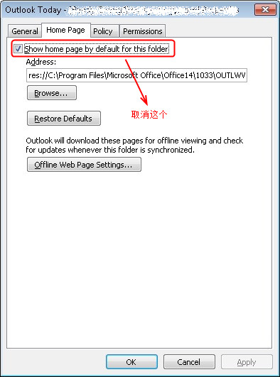

[KB289949 - Items that you place in Outlook Today seem to be lost](http://support.microsoft.com/kb/289949 "Items that you place in Outlook Today seem to be lost")

不知道有没有人注意到这个旧的 KB 文章，说的是啥事呢？

你试着从 Outlook 里面选中一些邮件，然后鼠标右键，Move-Other Folder，选中顶级目录，也就是 username@mail.com 这个级别，然后你会发现这些邮件不见了！ 收件箱里面没有，只有用搜索功能才能找到，点到顶级目录，你也只能看到这个：

&nbsp;

那么，我的邮件去哪儿了呢？

其实，这些被移动的邮件去到了 邮箱的顶级目录，但是默认情况下，这里被 Outlook Today 所代替了，这个 KB 讲的就是如何关掉 Outlook Today, 然后让你“丢失”的邮件重见天日的。说的是 Outlook 2003，实际上从 Outlook 2003 一直到 2013 版本都适用。

