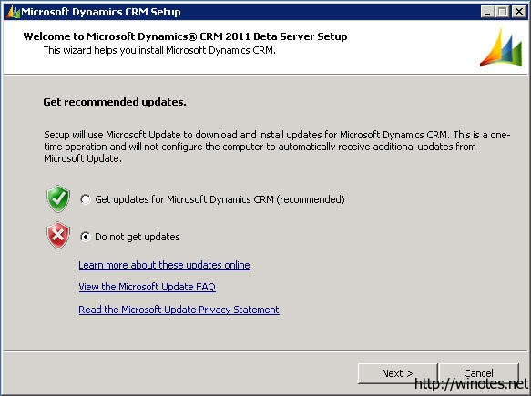
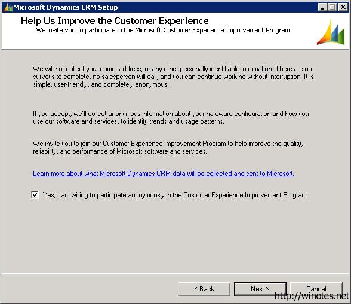

微软在9月17日在网站上放出了 CRM 2011 （也就是CRM5.0）的 beta 版本，我就先来个简单的快读安装图解，一睹为快，下个月会写点新版 CRM 的使用感受。

下载：

[Microsoft Dynamics CRM 2011 Beta](http://www.microsoft.com/downloads/details.aspx?FamilyID=0c7dcc45-9d41-4e2e-8126-895517b4274c&amp;displayLang=zh-cn)

[Microsoft Dynamics CRM 2011 Software Development Kit (SDK)](http://www.microsoft.com/downloads/info.aspx?na=40&amp;p=3&amp;SrcDisplayLang=zh-cn&amp;SrcCategoryId=&amp;SrcFamilyId=0c7dcc45-9d41-4e2e-8126-895517b4274c&amp;u=http%3a%2f%2fgo.microsoft.com%2ffwlink%2f%3fLinkID%3d200082)

[Microsoft Dynamics CRM 2011 Beta Implementation Guide](http://www.microsoft.com/downloads/info.aspx?na=40&amp;p=2&amp;SrcDisplayLang=zh-cn&amp;SrcCategoryId=&amp;SrcFamilyId=0c7dcc45-9d41-4e2e-8126-895517b4274c&amp;u=http%3a%2f%2fgo.microsoft.com%2ffwlink%2f%3fLinkID%3d200050)

界面一览

1. 自动更新安装程序；

2. 输入安装 Key，在 ReadMe 文件里面有， beta 版本试用有效期是 270 天；

3. 新的组件需求；

 
4. 选择目录，继续；

5. 新的角色：前端、后端、部署管理；

6. 和 4.0 一样的选择 AD 用户和组创建位置；

   

7. 创建一个 CRM 组织；

8. 选择报表服务器；
 
 

9. 安装前需求全部满足，开始安装；
 
 

10. 如果分开部署，这里要安装 Reporting Extensions for SSRS Setup；
