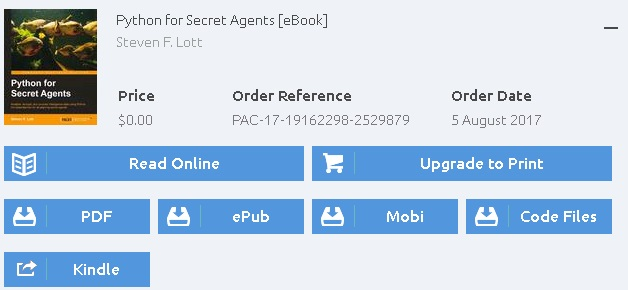
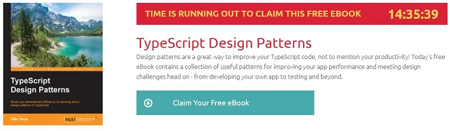

[Packt](https://www.packtpub.com/)是一家创立于2004年，总部位于英国伯明翰的技术书籍出版商，对电子书支持非常友好，除了主流的 PDF 格式以外，还支持 ePub, Mobi格式，还有源码提供，甚至可以直接将电子书发送至你的 Kindle 设备。

目前每天都提供一本免费的电子书，需要注册登录，然后到下面这个链接领取：

**https://www.packtpub.com/packt/offers/free-learning**

比如今天送的是这本 TypeScript Design Patterns

> 注意：由于 PacktPub 网站已经启用了 Google 的 reCAPTCHA 验证码，所以你需要科学上网才能领取。
