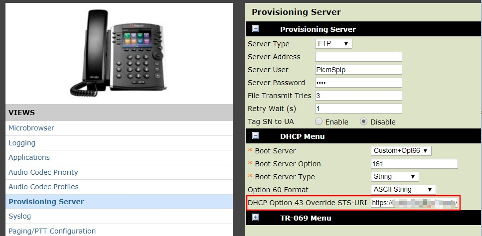

### 前言
这个问题是以前遇到过的，最近又有人问起，索性在此记录一下：

在部署 Skype/Lync 过程中，我们需要用到 DHCP Option 120 和 43，通常来说，我们会使用 Windows 服务器来做 DHCP，但有的时候，我们在分支机构可能会使用本地的路由器来当 DHCP 服务器，Option 120 通常没有问题，而坑出现在 Option 43, 因为 Skype 走的是 TCP，而且是 SIP over TLS，所以 Option 43 里面是不可以用 IP 地址的，必须要用 FQDN，而且大多数设备需要输入16进制而不是 ASCII 码，那这个时候，你有可能会遇到以下两种情况：

<!--more-->

1. 你的 SIP 服务器的 FQDN 名字长度很短，没有超过23个字符，那么使用 DHCPUtil.exe 生成的 Option 43 的 Hex 值长度会在180个字符以内，这种情况使用思科路由器作 DHCP 没有问题:
``` msdos
C:\Program Files\Common Files\Skype for Business Server 2015>DHCPUtil.exe -sipserver server.fqdn.company.com
SIP Server FQDN : server.fqdn.company.com
Certificate Provisioning Service URL : https://server.fqdn.company.com:443/CertProv/CertProvisioningService.svc

Option 120:
0006736572766572046671646E07636F6D70616E7903636F6D00

Vendor Class Identifier: MS-UC-Client
Option 43 (for vendor=MS-UC-Client):
        Full Option 43 value (Length: 180) : 
        010C4D532D55432D436C69656E740205687474707303177365727665722E6671646E2E636F6
        D70616E792E636F6D040334343305252F4365727450726F762F4365727450726F766973696F6E696E67536572766963652E737663
        sub-option 1 <UC Identifier>: 4D532D55432D436C69656E74
        sub-option 2 <URL Scheme>: 6874747073
        sub-option 3 <Web Server FQDN>: 7365727665722E6671646E2E636F6D70616E792E636F6D
        sub-option 4 <Port>: 343433
        sub-option 5 <Relative Path for Cert Prov>: 2F4365727450726F762F4365727450726F766973696F6E696E67536572766963652E737663

To configure DHCP Server with appropriate values, you can do one of the following things:
        1. Run DHCPUtil on the DHCP Server: use '-RunConfigScript' switch
        2. Run the following command on the DHCP Server (modify the path of DHCPConfigScript.bat appropriately):
"C:\Program Files\Common Files\Skype for Business Server 2015\DHCPConfigScript.bat" Configure MS-UC-Client 0006736572766572046671646E07636F6D70616E7903636F6D00 4D532D55432D436C69656E74 6874747073 
7365727665722E6671646E2E636F6D70616E792E636F6D 343433 2F4365727450726F762F4365727450726F766973696F6E696E67536572766963652E737663
```
### 踩坑
2. 一旦你的 SIP 服务器的 FQDN 名字长度超过23个字符，DHCPUtil.exe 生成的 Option 43 的 Hex 值长度会超过180个字符：
``` msdos
C:\Program Files\Common Files\Skype for Business Server 2015>DHCPUtil.exe -sipserver sipserver.fqdn.company.com
SIP Server FQDN : sipserver.fqdn.company.com
Certificate Provisioning Service URL : https://sipserver.fqdn.company.com:443/CertProv/CertProvisioningService.svc

Option 120:
0009736970736572766572046671646E07636F6D70616E7903636F6D00

Vendor Class Identifier: MS-UC-Client
Option 43 (for vendor=MS-UC-Client):
        Full Option 43 value (Length: 186) : 
        010C4D532D55432D436C69656E7402056874747073031A7369707365727665722E6671646E2
        E636F6D70616E792E636F6D040334343305252F4365727450726F762F4365727450726F766973696F6E696E67536572766963652E737663
        sub-option 1 <UC Identifier>: 4D532D55432D436C69656E74
        sub-option 2 <URL Scheme>: 6874747073
        sub-option 3 <Web Server FQDN>: 7369707365727665722E6671646E2E636F6D70616E792E636F6D
        sub-option 4 <Port>: 343433
        sub-option 5 <Relative Path for Cert Prov>: 2F4365727450726F762F4365727450726F766973696F6E696E67536572766963652E737663

To configure DHCP Server with appropriate values, you can do one of the following things:
        1. Run DHCPUtil on the DHCP Server: use '-RunConfigScript' switch
        2. Run the following command on the DHCP Server (modify the path of DHCPConfigScript.bat appropriately):
"C:\Program Files\Common Files\Skype for Business Server 2015\DHCPConfigScript.bat" Configure MS-UC-Client 0009736970736572766572046671646E07636F6D70616E7903636F6D00 4D532D55432D436C69656E74 6874747073 7369707365727665722E6671646E2E636F6D70616E792E636F6D 343433 2F4365727450726F762F4365727450726F766973696F6E696E67536572766963652E737663
```

这个时候，坑就来了，当你复制 Option 43 这一段去到思科路由器上的时候，路由器并不会报错，但是会将你输入的值截短至**180**个字符

而且没有任何提示，如果是在部署 Skype 电话的时候，你会发现 PIN 认证始终没法出现，你要不仔细检查的话是发现不了问题。

输入的命令
``` plain
ip dhcp pool POOL1
 network 192.168.10.0 255.255.255.0
 domain-name corp.company.local
 dns-server 119.29.29.29 8.8.8.8
 default-router 192.168.10.1
 option 43 hex 010C4D532D55432D436C69656E7402056874747073031A7369707365727665722E6671646E2E636F6D70616E792E636F6D040334343305252F4365727450726F762F4365727450726F766973696F6E696E67536572766963652E737663
 option 120 hex 0009736970736572766572046671646E07636F6D70616E7903636F6D00
 lease 1
```

路由器接受的：
``` plain
ip dhcp pool POOL1
 network 192.168.10.0 255.255.255.0
 domain-name corp.company.local
 dns-server 119.29.29.29 8.8.8.8
 default-router 192.168.10.1
 option 43 hex 010c.4d53.2d55.432d.436c.6965.6e74.0205.6874.7470.7303.1a73.6970.7365.7276.6572.2e66.7164.6e2e.636f.6d70.616e.792e.636f.6d04.0334.3433.0525.2f43.6572.7450.726f.762f.4365.7274.5072.6f76.6973.696f.6e69.6e67.5365.7276.6963.652e
 option 120 hex 0009.7369.7073.6572.7665.7204.6671.646e.0763.6f6d.7061.6e79.0363.6f6d.00
 lease 1
```
可以看到，Option 43 最后的6个字符 **737663** 被吃了！

思科对此的解释如下，自 IOS 15.1(3)S 以后，Option 后面跟的 hex 部分做了长度限制，超过 180 字符的部分将被截短。

| Release | Modification |
| - | - |
| 12.0(1)T | This command was introduced. |
|12.2(33)SRA | This command was integrated into Cisco IOS Release 12.2(33)SRA. |
| 12.2SX | This command was supported in the Cisco IOS Release 12.2SX train. Support in a specific 12.2SX release of this train depends on your feature set, platform, and platform hardware. |
| 12.4(24)T | This command was modified. The none keyword was added. |
| 15.1(3)S | This command was modified. A maximum limit of 180 characters was set for the dotted hexadecimal data and 255 characters for the ASCII data. |

> The hexadecimal value is truncated to 180 characters entered. Each byte in hexadecimal character strings is two hexadecimal digits. Each byte can be separated by a period, colon, or white space.


### 解决方案
那么有什么解决方案吗？

1. 缩短你的 SIP 服务器 FQDN 名称小于等于23个字符
2. 换用其它设备或者服务器系统作为 DHCP，比如把 DHCP 从思科路由器上移到思科交换机（思科交换机不存在这个问题）上或者干脆用 Windows Server
3. 降级路由器的 IOS 版本至 15.1(3)S 以下
3. 升级 IOS 版本，在 Cisco IOS XE Release 3.2.1S 之后引入了一个 option ext 的命令，这个扩展命令可以支持 255 个字节的 hex 值。

> 思科官方介绍：
Using the option ext command you can specify an ASCII string upto 255 characters or 255 bytes of hexadecimal data.

所以你的命令看起来应该是这样的：
``` plain
ip dhcp pool POOL1
 network 192.168.10.0 255.255.255.0
 domain-name corp.company.local
 dns-server 119.29.29.29 8.8.8.8
 default-router 192.168.10.1
 option ext 43 hex Your full Option 43 hex value here - part1
 option ext 43 hex Your full Option 43 hex value here - part2
 option 120 hex Your Option 120 hex value here
 lease 1
```

如果这些方案你都没办法实施，那么在部署某些设备比如 Polycom VVX 系列的 Skype Phone 的时候，你还可以用 DHCP Override 去指定 SIP 服务的 URI：


### 附件
最后，再附上  和相关的  下载，希望以上能帮到被此困扰的朋友。
